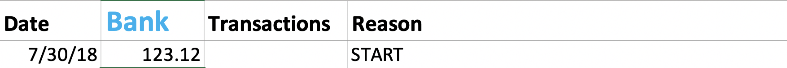
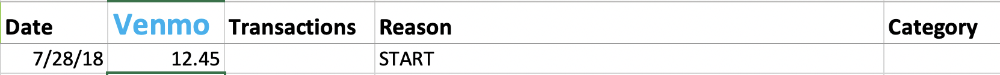

# Finance Scraper Chrome Extension

The chrome extension is designed to scrape information from [Capital One](https://www.capitalone.com/) (checking account) and [Venmo](https://venmo.com/), and transcribe that information into an existing Microsoft Excel spreadsheet. It utilizes **Python** and **JavaScript** to carry out this function. 

Although, the transcribing to Excel is unique to organization of my spreadsheet, there are a few ways (look in the commented portions of [app.py](https://github.com/arunsrinivas20/finance-scraper/blob/master/extension/app.py)) to customize it based on your organization. I am currently working on ways to make the entire process more general. 

# 

## Part I. Setting up for scraping

1. Make sure that you have an existing spreadsheet for the extension to write to. Within the file, mark locations for Venmo and/or Capital One. Here is how the tables within my sheet are organized:
 
 
Capital One Table Screenshot

 
 
Venmo Table Screenshot

 
 
In both of these screenshots, the first column represents the date of the transaction, the second (title) column represents the amount in the account after applying the transaction, the third column represents the transaction amount, and the fourth column represents the reason for the transactions. In the Venmo screenshot, the fifth column represents the category for the transaction, but the auto-categorization process is still being implemented. 

2. Load the unpacked Chrome extension (just the extension folder) into Chrome by navigating to the URL [chrome://extensions/](chrome://extensions/). Once it is loaded, navigate to either [Capital One](https://www.capitalone.com/) or [Venmo](https://venmo.com/). On Venmo's site, login and then click the **Mine** tab to view your personal transactions. On Capital One's site, login and click your personal checking account tab to view your transactions for that account.

3. Before starting to scrape, uncomment and change a couple of lines of code in [app.py](https://github.com/arunsrinivas20/finance-scraper/blob/master/extension/app.py). Uncomment lines 36-37, which allow the application to automatically transcribe the new transactions to the Excel spreadsheet and commit those transactions to the local database. Change lines 175 and 180 to the corresponding table names (i.e. what I have in blue in the screenshots above). After that, start the Flask application. Navigate to **...../finance-scraper/extension/requirements.txt** and install the necessary dependencies using **pip3 install -r requirements.text**. After that, run the command **python3 [app.py](https://github.com/arunsrinivas20/finance-scraper/blob/master/extension/app.py)**.

## Part II. Scraping the transactions

1. After navigating to either the Capital One or Venmo transactions page and starting the Flask application, click the Chrome extension to display a popup. Enter the path of the Excel spreadsheet in the first input box and the name of the sheet containing the Capital One or Venmo table. Make sure the Excel spreadsheet is not opened. Click **Submit** to scrape the transactions from the respective site. 

2. After clicking submit, the local database will be initialized, if nothing exists, and the transactions will be written and committed to the Excel spreadsheet and local database, respectively. 

3. Once the transcribing is complete, Chrome will display a popup notification, alerting that the process has completed and Y number of transactions have been recorded. The appended dataframe can also be seen in the terminal output. 